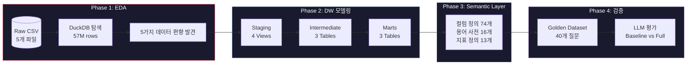
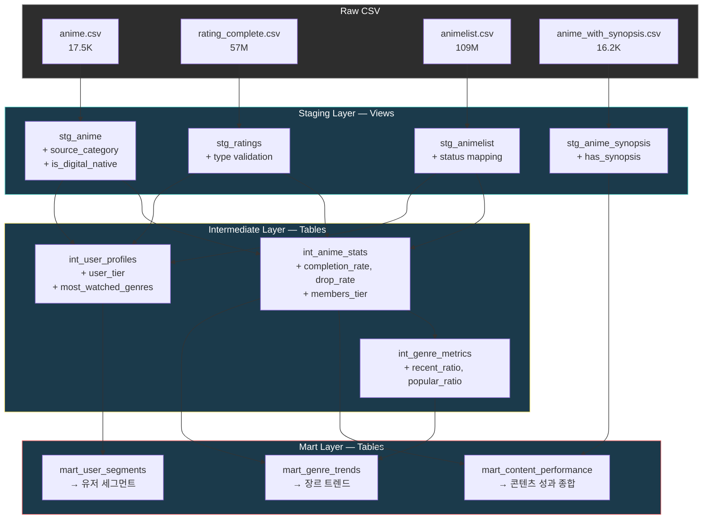

# MAL Analytics Engineering

MyAnimeList 57M+ ratings 데이터 기반 **3-Layer Data Warehouse 설계** + **Semantic Layer 구축** + **LLM Text-to-SQL Golden Dataset 검증** 프로젝트

<br>

## 핵심 수치

| 항목 | 수치 |
|:-----|:-----|
| 데이터 규모 | 17.5K anime · 310K users · **57M ratings** · 109M list entries |
| dbt 모델 | **10개** (Staging 4 + Intermediate 3 + Mart 3), 30개 테스트 전체 통과 |
| Semantic Layer | 74개 컬럼 정의 · 16개 용어 사전 · 13개 지표 정의 (한/영 병기) |
| Golden Dataset | **40개** 자연어 질문 + **40개** 검증된 SQL (5 카테고리 × 3 난이도) |
| LLM 실행 성공률 | Baseline **100%** / Full **100%** |
| LLM 결과 일치율 | Baseline 50.0% / Full 50.0% (개선 없음 — 분석 포함) |

<br>

---

## Quick Start

```bash
# 의존성 설치
poetry install

# dbt 모델 실행
cd dbt_project
poetry run dbt run --profiles-dir .
poetry run dbt test --profiles-dir .    # 30개 테스트 전체 통과

# LLM 평가 (선택 — Gemini API 키 필요)
cd ..
GEMINI_API_KEY=your_key poetry run python golden_dataset/llm_evaluation/evaluate.py
```

- **요구 사항:** Python 3.10+ · [Poetry](https://python-poetry.org/)
- **선택:** Gemini API 키 (LLM 평가 실행 시)

<br>

---

## 아키텍처

### 전체 파이프라인



### DW 레이어 구조



<br>

---

## LLM 평가 결과

같은 40개 질문을 **Baseline**(스키마만) vs **Full**(+ Semantic Layer) 두 조건으로 Gemini API에 제공하여 비교했습니다.

| 지표 | Baseline (스키마만) | Full (+ Semantic Layer) | 차이 |
|:-----|:---------|:-----------------------|:-----|
| 실행 성공률 | **100.0%** (40/40) | **100.0%** (40/40) | 0%p |
| 구조 일치율 | 7.5% (3/40) | 5.0% (2/40) | -2.5%p |
| **결과 일치율** | **50.0%** (20/40) | **50.0%** (20/40) | **0%p** |

> **평가 지표 설명**
> - `구조 일치율(structure_match)`: 행 수 + 컬럼 수가 정확히 일치
> - `결과 일치율(result_match)`: 공통 컬럼 기준 정렬 후 50%+ 행의 값이 일치 ← 핵심 지표

**핵심 발견:** Semantic Layer가 결과 일치율을 개선하지 못했다. 개선된 케이스(+3)와 퇴보한 케이스(-3)가 정확히 상쇄되었으며, 이는 두 가지 사실을 시사한다.

1. **잘 설계된 mart 컬럼명은 그 자체가 Semantic Layer다.** `completion_rate`, `drop_rate`, `avg_rating`처럼 의미가 명확한 컬럼명은 별도 문서 없이도 LLM이 올바르게 사용했다.
2. **Semantic Layer가 오히려 방해가 되는 경우가 있다.** `accepted_values` 명시가 불필요한 WHERE 절 추가를 유발하거나, 컬럼 설명이 LLM의 SELECT 범위를 과도하게 확장시켜 golden query와 불일치를 만들었다.

→ 케이스 스터디 및 상세 분석: [`docs/project_summary.md`](docs/project_summary.md)

<br>

---

## 프로젝트 구조

```
mal-analytics-engineering/
│
├── notebooks/                    #  EDA
│   ├── 01_eda_anime.ipynb        #  메타데이터 — 롱테일, 장르, 스튜디오
│   ├── 02_eda_ratings.ipynb      #  57M 평점 — 파워유저, Positivity Bias
│   └── 03_eda_reviews.ipynb      #  시놉시스 텍스트 분석
│
├── dbt_project/                  #  DW 모델링
│   ├── dbt_project.yml
│   ├── profiles.yml
│   └── models/
│       ├── staging/              #  4 views — 정제, 타입 캐스팅, 파생 컬럼
│       ├── intermediate/         #  3 tables — 조인, 집계, 세그먼트 산출
│       └── marts/                #  3 tables — 비즈니스 질문 답변용
│
├── semantic_layer/               #  Semantic Layer (한/영 병기)
│   ├── table_definitions.yml     #  74개 컬럼 정의
│   ├── business_glossary.yml     #  16개 비즈니스 용어 사전
│   ├── metric_definitions.yml    #  13개 지표 정의
│   └── query_patterns.yml        #  7개 DuckDB 쿼리 패턴
│
├── golden_dataset/               #  Golden Dataset + LLM 평가
│   ├── questions.yml             #  40개 질문 (5 카테고리 × 3 난이도)
│   ├── golden_queries.sql        #  40개 검증된 Golden SQL
│   └── llm_evaluation/
│       ├── evaluate.py           #  Gemini API 평가 스크립트
│       └── results.json          #  Baseline vs Full 비교 결과
│
├── docs/                         #  설계 문서
│   ├── project_summary.md        #  프로젝트 상세 리포트
│   ├── dw_design.md              #  DW 설계 문서
│   └── data_lineage.md           #  데이터 리니지 다이어그램
│
├── pyproject.toml
└── poetry.lock
```

<br>

---

## 기술 스택 & 데이터셋

| 역할 | 기술 |
|:-----|:-----|
| 분석 엔진 | **DuckDB** — 57M rows 로컬 분석 |
| 모델링 | **dbt-core** + **dbt-duckdb** — 3-Layer DW |
| 데이터 처리 | **Python** · Pandas · Jupyter |
| LLM 평가 | **Gemini API** (gemini-3.1-flash-lite-preview) |
| 패키지 관리 | **Poetry** |
| 시각화 | Matplotlib · Seaborn |

**데이터셋:** [MyAnimeList Recommendation Database 2020](https://www.kaggle.com/datasets/hernan4444/anime-recommendation-database-2020) — 17,562 anime · 310K users · 57M ratings

| 소스 파일 | 행 수 | 설명 |
|:----------|:------|:-----|
| `anime.csv` | 17,562 | 애니메이션 메타데이터 |
| `rating_complete.csv` | 57M | 유저 평점 (시청 완료 + 점수 부여) |
| `animelist.csv` | 109M | 유저 시청 목록 (시청 상태 포함) |
| `anime_with_synopsis.csv` | 16,214 | 시놉시스 텍스트 |
| `watching_status.csv` | 5 | 시청 상태 코드 매핑 |

<br>

---

## 상세 문서

| 문서 | 내용 |
|:-----|:-----|
| [`docs/project_summary.md`](docs/project_summary.md) | 프로젝트 전체 상세 리포트 |
| [`docs/dw_design.md`](docs/dw_design.md) | DW 설계 문서 |
| [`docs/data_lineage.md`](docs/data_lineage.md) | 데이터 리니지 다이어그램 |
